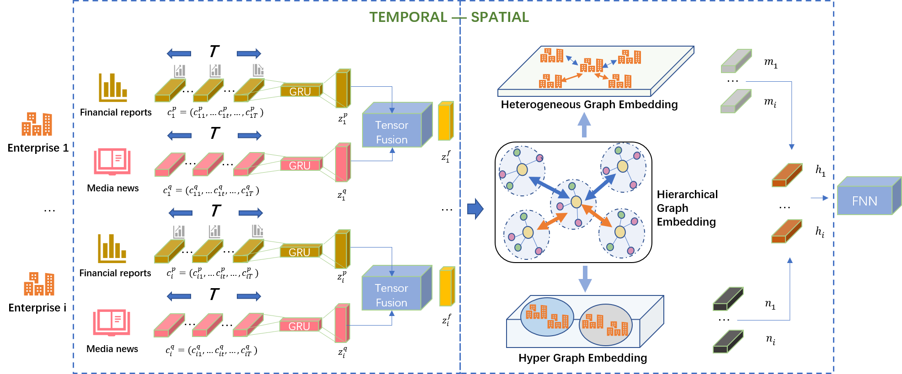

# STAGE

This is the implementation of "ENTERPRISE FINANCIAL RISK ANALYSIS WITH SPATIAL-TEMPORAL AWARE GNN".



# Usage

- ```models.py```: includes implementation of STAGE model.
- ```train.py```: includes codes for training and testing.
- ```utils.py```: includes codes for loading data and some other functions.
- ```data/```: includes codes and processed datasets:
  - ```data.zip```: The processed dataset for enterprise financial risk analysis.
  - ```data_process.ipynb```: The code for processing data.

# Model Training

```
# Unzip the dataset
upzip ./data/data.zip ./data/

# Train and test the dataset
python train.py
```

# Dataset Description

| Node                                           | \#Nodes                                   | Risky(%)                           | Relation                              | \#Edges                                   |
| ---------------------------------------------- | ----------------------------------------- | ---------------------------------- | ------------------------------------- | ----------------------------------------- |
| Core Enterprise<br />SMEs<br />Person<br />ALL | 5,317<br />14,071<br />22,722<br />42,110 | 559 (10.5\%) <br />-<br />-<br />- | E-S-E<br />E-H-E<br />E-C-E<br />Homo | 1,000<br />29,668<br />22,718<br />53,386 |

The enterprise financial risk analysis dataset is obtained from the China Stock Market and Accounting Research (CSMAR) database. We select 5,317 publicly listed Chinese companies traded on Stock Exchanges between 2020 and 2023. We collect 14,071 small and medium-sized enterprises and 22,722 legal persons and executives. The dataset contains 42,110 nodes and 53,386 edges. 

The dataset has three relations: 

1) E-S-E which represents the supply chain relationship between enterprises;
2) E-H-E which represents the shareholder relationship between enterprises;
3) E-C-E which represents the executive relationship between enterprises. 
